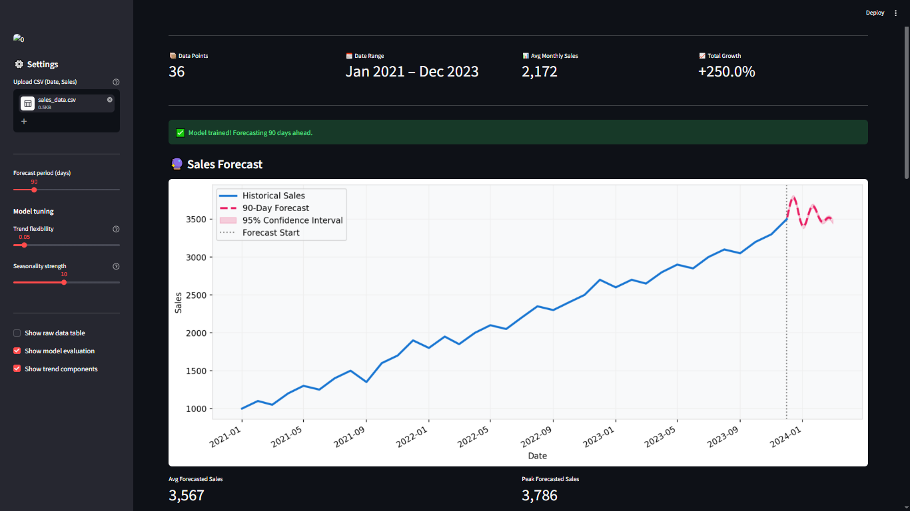
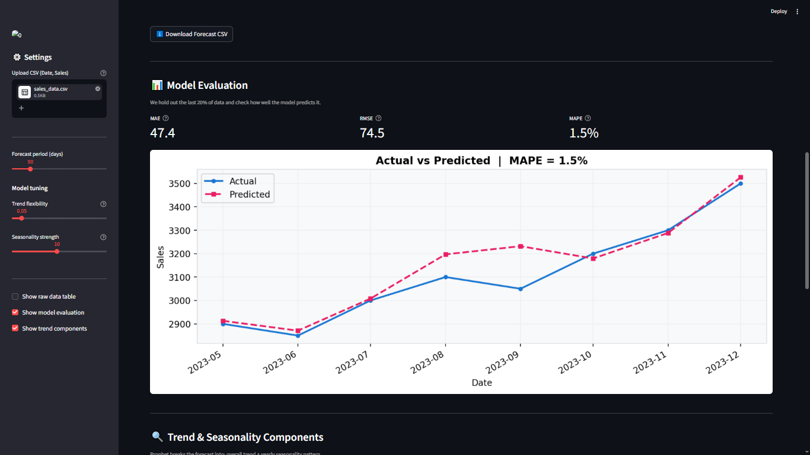
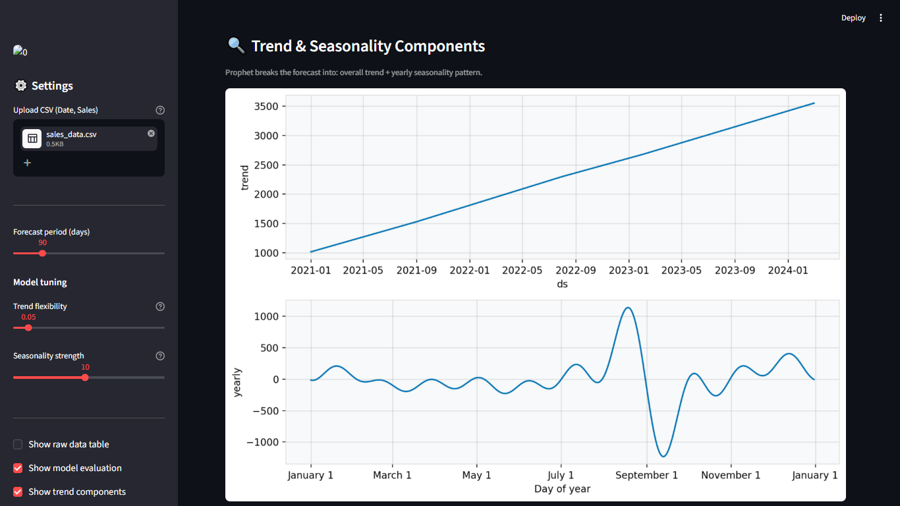

# AI Sales Intelligence Dashboard

An AI-powered Sales Forecasting and Business Intelligence Dashboard built using Machine Learning and Time Series Analysis.

---

## 🚀 Features

- Sales forecasting using Prophet, ARIMA, and Linear Regression
- Interactive Streamlit dashboard
- Trend and seasonality analysis
- Forecast visualization with confidence intervals
- Model evaluation using MAE, RMSE, and MAPE
- Business insights generation
- CSV upload support

---

## 🛠 Tech Stack

- Python
- Pandas
- Prophet
- Scikit-learn
- Streamlit
- Matplotlib
- Statsmodels

---

## 📸 Dashboard Preview

### Main Dashboard


---

### Model Evaluation


---

### Trend & Seasonality Analysis


---

## ⚙️ Installation

```bash
pip install -r requirements.txt
python forecast.py
python -m streamlit run app.py
```

---

## 📈 Models Used

- Prophet
- ARIMA
- Linear Regression

---

## 🎯 Future Improvements

- LLM-powered business insights
- Real-time forecasting
- Cloud deployment
- Advanced ensemble modeling

---

## 👨‍💻 Author

Jagshaan Singh
